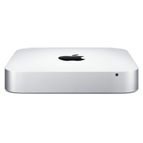
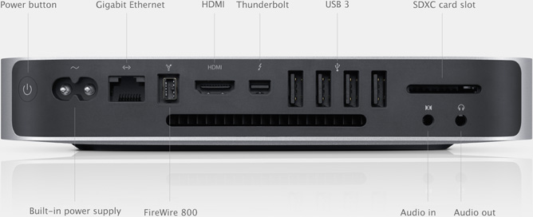

# MyMacMini-2012-Restoration
 

## Technical Specifications
### Original
**Processor:** 2.5GHz dual-core Intel Core i5 (Turbo Boost up to 3.1GHz) with 3MB L3 cache  
**Storage:** 2.5 GHz 500GB (5400-rpm) hard drive  
**Graphics:** Intel HD Graphics 4000 (built-in)  
**Memory:** 4GB (two 2GB) of 1600MHz DDR3 memory  
## Purpose
- Recording the journey of upgrading the old Mac Mini (late 2012)
- Make the old hardware to fit in moden world
- Work as a home server
